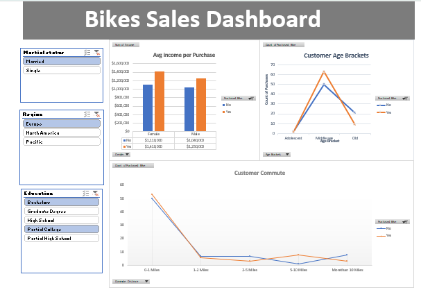

# 🚴 Bike Sales Analysis Dashboard

## 📌 Project Overview

This project analyzes customer demographics and purchasing behavior to identify factors that influence bike purchases. The dataset was cleaned, transformed, and analyzed using Microsoft Excel, and an interactive dashboard was developed to provide meaningful business insights.

The goal of this project is to help businesses understand their customer base and make data-driven marketing and sales decisions.

---

## 🎯 Business Problem

A bike company wants to understand which customer characteristics are associated with bike purchases. By analyzing demographic and lifestyle factors, the company can better target potential customers and improve sales performance.

---

## 📊 Dataset Information

The dataset contains customer information such as:

- Customer ID
- Marital Status
- Gender
- Age
- Income
- Education
- Occupation
- Home Ownership
- Number of Cars
- Number of Children
- Commute Distance
- Region
- Bike Purchase Status

---

## 🧹 Data Cleaning & Preparation

The following data preparation steps were performed:

- Removed duplicate records
- Checked data quality and consistency
- Standardized categorical values
- Created Age Brackets for better analysis
- Organized data into a structured format
- Prepared data for Pivot Tables and Dashboard creation

---

## 🔍 Analysis Performed

The analysis focused on identifying patterns between customer characteristics and bike purchases, including:

- Income vs Bike Purchase
- Age Group vs Bike Purchase
- Commute Distance vs Bike Purchase
- Regional Bike Purchase Trends
- Demographic Analysis

---

## 📈 Dashboard Features

The dashboard includes:

- Interactive Slicers
- Dynamic Pivot Charts
- Income Analysis
- Age Group Analysis
- Commute Distance Analysis
- Regional Comparison
- Customer Segmentation Insights

Users can filter dashboard results to explore different customer groups and purchasing behaviors.

---

## 📷 Dashboard Preview

### Main Dashboard



*Replace the image above with your dashboard screenshot.*

---

## 💡 Key Insights

- Customers with higher incomes tend to purchase bikes more frequently.
- Middle-aged customers represent the largest segment of bike buyers.
- Commute distance appears to influence purchasing decisions.
- Purchasing behavior differs across regions.
- Demographic factors play an important role in customer buying patterns.

---

## 🛠 Tools Used

- Microsoft Excel
- Pivot Tables
- Pivot Charts
- Slicers
- Dashboard Design
- Data Visualization Techniques

---

## 🚀 Skills Demonstrated

- Data Cleaning
- Data Transformation
- Exploratory Data Analysis (EDA)
- Dashboard Development
- Data Visualization
- Business Intelligence
- Analytical Thinking
- Data Storytelling

---

## 📁 Repository Structure

```text
Bike-Sales-Analysis-Dashboard/
│
├── Bike Sales Dashboard.xlsx
├── Dashboard.png
└── README.md
```

